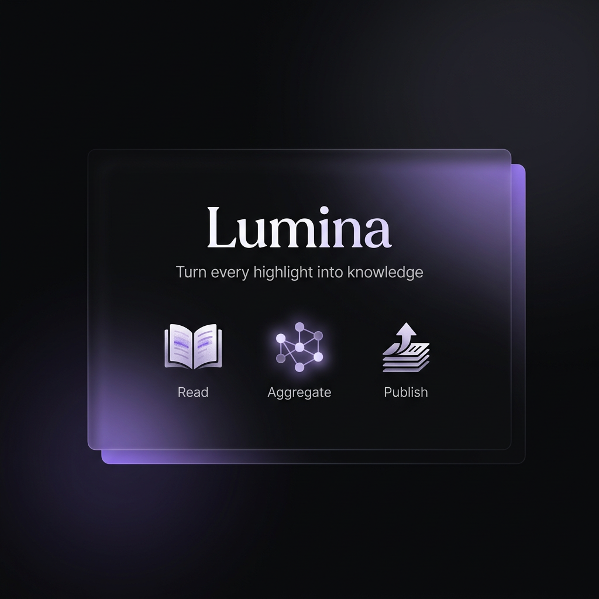

<p align="center">
  
</p>

<p align="center">
  An intelligent reading knowledge base that automatically turns book highlights<br/>
  into cross-book viewpoint articles using AI.
</p>

---

## Features

- **Library** — Upload PDF/EPUB, browse covers, manage your collection
- **Reader** — In-browser reading with multi-color highlighting and annotations
- **AI Explain** — Select text, get instant AI-powered explanations
- **Aggregation Engine** — Highlights are vectorized and clustered into viewpoint articles automatically
- **Knowledge Graph** — D3.js force-directed visualization of viewpoint connections
- **Publish** — Export to Markdown/PDF/HTML, push to Webhook or KMS targets
- **Settings** — BYOK model configuration, storage, and aggregation scheduling

## 本地开发

```bash
npm install
npm run dev
```

默认地址：`http://localhost:3000`

默认演示账号：

- 邮箱：`demo@lumina.local`
- 密码：`lumina123`

## Docker 启动

```bash
make start
```

启动后访问：`http://localhost:20261`

数据会持久化在仓库根目录的 `data/`，目录结构如下：

- `data/app`：应用本地业务数据
- `data/postgres`：PostgreSQL 数据
- `data/redis`：Redis 持久化数据
- `data/minio`：MinIO 对象数据
- `data/minio-config`：MinIO 配置

默认会一起启动这些技术组件，并加入同一个 `lumina-network`：

- `lumina-app`
- `lumina-postgres`
- `lumina-redis`
- `lumina-minio`

## 基础性能配置

当前 Compose 默认按“至少 100 人在线”的基础目标给出一套保守配置：

- 应用容器：`2 CPU / 2GB RAM`
- PostgreSQL：`2 CPU / 2GB RAM`，`max_connections=300`
- Redis：`1 CPU / 512MB RAM`
- MinIO：`1 CPU / 1GB RAM`

建议宿主机至少预留 `4C8G` 可用资源。

## 主要实现说明

- 前端：`Next.js App Router`
- API：`Hono`，统一挂载在 `app/api/[[...route]]/route.ts`
- 持久化：本地 JSON 数据库 + 本地上传目录
- 发布：支持 Webhook/KMS 目标配置与手动触发
- 导出：支持 Markdown / PDF

## 验证

```bash
npm run lint
npm run build
npm run verify
```
