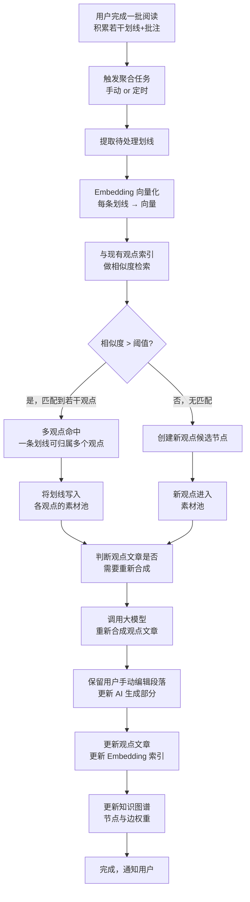

# Lumina - 智能阅读知识库 PRD

> 版本：v0.3（方案探讨阶段）
> 日期：2026-03-22

---

## 一、产品定位

**一句话描述：** 面向深度阅读者的智能知识库 SaaS，让阅读中的每一条划线自动沉淀为跨书籍的个人认知文章体系，并支持定时发布到外部平台。

**目标用户：** 有系统阅读习惯、希望将书本知识内化为个人思想体系的用户（早期以 IT/知识工作者为主）。

**核心原则：**
- 极简克制，用户只负责阅读和划线，其余全自动
- 纯个人工具，无社交，无内容分发
- 用户自带模型（BYOK），平台不托管 AI 成本

**知识库核心理念（重要）：**

> 知识库的组织单元是**观点 / 主题**，而不是书籍。
>
> - ❌ 错误理解：一本书 → 一篇笔记
> - ✅ 正确理解：一个观点/主题 → 一篇跨书聚合文章
>
> 例如，用户读了《从0到1》《穷查理宝典》《原则》三本书，关于「第一性原理思维」这一观点的划线会被自动聚合成一篇文章；关于「长期主义」的划线聚合成另一篇文章。同一本书的划线可以同时归属多个不同观点。
>
> 这意味着知识库中的文章树是**按思想主题组织的**，与书籍来源无关。

---

## 二、整体页面结构

Web 端，左侧固定 Sidebar（4 个一级入口） + 右侧主内容区。

```
┌─────────┬──────────────────────────────────────────┐
│  Logo   │                                          │
├─────────┤            主内容区                       │
│  书库   │                                          │
│  知识库 │                                          │
│  图谱   │                                          │
│  发布   │                                          │
├─────────┤                                          │
│  设置   │                                          │
└─────────┴──────────────────────────────────────────┘
```

风格：极简现代，中性色系，大量留白，无多余装饰。

---

## 三、功能模块详细设计

### 3.1 书库（Library）

书架视图，核心是"导入 → 阅读 → 划线"这条最简链路。

**书架页：**
- 封面网格视图，支持按分类/标签筛选
- 顶部操作：上传 PDF/EPUB（文件存入 MinIO）、新建分类
- 书籍卡片：封面、书名、作者、阅读进度、最近阅读时间

**阅读页（点击书籍后进入）：**

| 功能项 | 说明 |
|--------|------|
| 格式支持 | 原生 PDF（PDF.js）、EPUB（epub.js） |
| 划线/高亮 | 多色高亮，选中文字后弹出操作菜单 |
| 批注 | 划线后可附加文字批注（我的思考） |
| 即时理解 | 选中文字后可触发 AI 解释/扩展（调用用户配置的模型） |
| 阅读进度 | 自动记录，多设备同步 |
| 排版设置 | 字体大小、行距、背景色（日/夜/护眼） |
| 键盘快捷键 | 翻页、高亮、全屏（电脑端优先） |

**存储细节：**
- 书籍文件 → MinIO 对象存储，按用户隔离
- 划线/批注 → 数据库精确记录：书籍 ID、章节、段落 offset、起止字符位置
- 支持通过位置信息一键跳回原文

---

### 3.2 知识库（Knowledge Base）

**界面布局：** 三栏
```
┌──────────────┬───────────────┬──────────────────────────┐
│  观点文件树  │   文章列表    │       文章正文            │
│              │               │  （可编辑，含引用跳转）  │
└──────────────┴───────────────┴──────────────────────────┘
```

- 左栏：树形结构，展示所有观点节点（类似 Notion 的文档树）
- 中栏：选中某观点后，列出该观点下的文章/版本
- 右栏：文章正文，富文本编辑器，AI 生成内容可直接编辑

**文章结构设计：**

每个观点对应一篇**结构化长文**，而不是划线列表。文章由大模型自动合成，具有完整的逻辑叙述：

```
# [观点标题]

## 核心论点
（AI 提炼的核心主张）

## 论据与展开
（各来源书摘穿插，逻辑递进，AI 负责衔接语言）

> 引用：《从0到1》第3章 · [跳转原文 ↗]
> "原文内容..."
> 我的批注：...

## 我的理解（用户批注汇总）

## 关联观点
（链接到其他观点文章）
```

- 80% 内容来自用户自己的划线和批注
- AI 负责：逻辑串联、层次梳理、语言润色
- 每次新增相关划线后，AI 重新合成并更新文章（保留用户手动编辑内容）
- 所有引用块支持**点击跳转原文**（精确到段落位置）

---

### 3.3 知识图谱（Graph）

**只读可视化**，展示各观点文章之间的关联关系。

| 功能项 | 说明 |
|--------|------|
| 节点 | 每个观点文章对应一个节点，节点大小 = 划线数量权重 |
| 边 | 两个观点被同一批划线同时引用，则产生关联边 |
| 交互 | 缩放、拖拽画布、点击节点跳转到对应知识库文章 |
| 筛选 | 按书籍、按标签、按时间范围筛选可见节点 |
| 聚焦模式 | 点击某节点，高亮显示其一二级关联节点 |

---

### 3.4 发布（Publish）

**界面：** 任务列表 + 右侧配置面板

**发布任务配置：**

| 配置项 | 说明 |
|--------|------|
| 来源文章 | 选择知识库中一篇或多篇观点文章 |
| 目标平台 | 配置目标（如 KMS 页面 URL、Notion API、Webhook） |
| 触发方式 | 手动触发 / 定时（cron） / 内容变更后延迟 N 分钟发布 |
| 发布格式 | Markdown / PDF / 富文本 |
| 状态记录 | 每次发布的时间、版本、状态（成功/失败） |

**知识库文章页右上角快捷操作：**
- 发送到邮件
- 一键导出 Markdown / PDF
- 手动推送到已配置的发布目标

---

### 3.5 设置（Settings）

| 模块 | 配置项 |
|------|--------|
| 模型配置 | Base URL、API Key、Model Name；支持配置多个模型分别用于：聚合分析 / 文章生成 / 即时解释；支持连通性测试 |
| Embedding 配置 | Embedding 模型地址和 Key（用于向量化，可与主模型分开配置） |
| 同步频率 | AI 聚合自动触发频率：每天 / 每周 / 手动 |
| 手动触发 | 一键立即执行一次全量聚合分析 |
| 存储 | MinIO 连接配置（或使用平台默认存储） |
| 账户 | 基本信息、密码修改、数据导出/删除 |

---

## 四、核心算法：划线聚合与知识库更新

### 4.1 整体流程图



### 4.2 向量化策略

**输入数据向量化：**

| 数据类型 | 向量化内容 | 说明 |
|---------|-----------|------|
| 划线原文 | 划线文字本身 | 核心语义载体 |
| 划线+批注 | 原文 + 用户批注拼接 | 批注能提升语义准确性 |
| 观点文章 | 文章标题 + 核心论点段落（前 500 字） | 代表该观点的语义中心 |

**相似度匹配规则：**

```
相似度分级：
- > 0.85：强关联，直接归属该观点
- 0.70 ~ 0.85：弱关联，归属 + 标记为"待确认"（用户可审核）
- < 0.70：不归属，若所有现有观点均 < 0.70，则创建新候选观点

一条划线可同时归属多个观点（多对多）。
```

**新观点合并规则：**
- 新候选观点积累 ≥ 3 条划线后，正式生成观点文章
- 候选观点与现有观点相似度 > 0.80，则合并而非新建

### 4.3 文章重新合成策略

每次观点素材池更新后，重新合成文章时：

1. 提取该观点所有划线 + 批注，按书籍 / 时间排序
2. 提示词结构：
   ```
   你是用户的个人知识助手。
   以下是用户在多本书中关于「{观点名称}」的划线和思考，
   请将其整合为一篇逻辑连贯、层次清晰的认知文章。
   要求：
   - 保留所有原文引用，标注来源
   - 以用户视角第一人称撰写
   - 观点递进，先总后分
   - 不要编造用户未提及的内容
   ```
3. 文章中标记 AI 生成段落 vs 用户手动编辑段落
4. 重新合成时，用户手动编辑段落不被覆盖，仅更新 AI 生成部分

### 4.4 数据库核心结构

```
Highlight（划线）
  - id
  - book_id
  - chapter_index
  - paragraph_offset_start / end   ← 精确位置，用于跳回原文
  - content                         ← 原文内容
  - note                            ← 用户批注
  - embedding vector                ← 向量
  - created_at

Viewpoint（观点节点）
  - id
  - title
  - summary_embedding               ← 观点摘要向量
  - article_content                 ← 合成文章（富文本）
  - last_synthesized_at

HighlightViewpoint（多对多关联）
  - highlight_id
  - viewpoint_id
  - similarity_score
  - confirmed                       ← 是否经用户确认

Book
  - id
  - user_id
  - title / author
  - minio_path                      ← 文件存储路径
  - format (PDF/EPUB)
```

---

## 五、平台策略

- **主力平台：** Web 端，电脑端体验优先
- **定位：** 纯个人工具，无社交，无内容分发
- **书籍来源：** 用户自行上传（MinIO 存储，用户隔离）
- **模型策略：** 用户自带 API Key（BYOK），OpenAI 兼容接口，支持本地 Ollama
- **聚合触发：** 批量触发，支持手动 + 用户自配频率（每天/每周）

---

## 六、技术栈

| 层级 | 方案 |
|------|------|
| 前端 | Next.js + shadcn/ui + Tailwind CSS |
| PDF 渲染 | PDF.js |
| EPUB 渲染 | epub.js |
| 富文本编辑器 | TipTap |
| 知识图谱可视化 | D3.js 或 Cytoscape.js |
| 后端 | Java（Spring Boot） |
| 数据库 | PostgreSQL |
| 向量数据库 | pgvector（PostgreSQL 插件，避免引入额外组件） |
| 对象存储 | MinIO（书籍文件） |
| 定时任务 | Spring Scheduler / Quartz |
| 大模型接入 | 透传用户配置的 OpenAI 兼容接口 |
| Embedding | 用户配置（如 text-embedding-3-small 或本地模型） |

---

## 七、设计决策记录

| 决策点 | 结论 |
|--------|------|
| 用户手动编辑保护 | 标记法：每段落存 `is_user_edited` 字段，编辑后打标，AI 重新合成时跳过已标记段落 |
| 发布目标 | MVP 支持 KMS / Webhook；微信公众号、Notion 直连后期考虑 |
| 向量库 | pgvector，不引入独立向量数据库 |
| 聚合触发 | 批量触发，支持手动 + 用户自配频率 |
| 知识图谱 | 只读可视化，不支持在图谱上编辑 |
| 书籍来源 | 用户自行上传，平台不提供书源 |
| 模型策略 | BYOK，OpenAI 兼容接口 |
| 社交功能 | 无，纯个人工具 |

## 九、MVP 范围

### MVP（核心链路，优先交付）

| 模块 | 功能 |
|------|------|
| 书库 | 上传 PDF/EPUB、阅读器、划线/高亮、文字批注 |
| 聚合 | 手动触发聚合分析、向量化匹配、观点文章生成 |
| 知识库 | 观点文件树、文章查看与编辑、原文引用跳转 |
| 设置 | 模型配置（主模型 + Embedding）、手动触发按钮 |
| 账户 | 邮箱注册登录、基础书库管理 |

### 二期

| 模块 | 功能 |
|------|------|
| 知识图谱 | 只读可视化、节点关联、点击跳转 |
| 自动触发 | 定时聚合（每天/每周），用户可配置频率 |
| 发布导出 | KMS/Webhook 发布任务、定时发布、Markdown/PDF 导出 |
| 阅读增强 | 划线即时 AI 解释 |
| 快捷操作 | 文章页发送邮件、一键推送 |

## 十、待细化问题

1. **微信读书导入**：后期功能，依赖网页抓取，暂不列入 MVP。
2. **冷启动体验**：前几本书划线较少时，观点文章和图谱质量有限，onboarding 引导策略待设计。
